# 📚 Nhã Nam BookStore — Hệ Thống Thương Mại Điện Tử & Quản Lý Nhà Sách Trực Tuyến


> **Đồ án Chuyên ngành IT6133 — Nhóm 8 (5 thành viên)**, Trường Công nghệ Thông tin & Truyền thông — Đại học Công nghiệp Hà Nội (HaUI).
> Xây dựng hệ thống thương mại điện tử bán sách Nhã Nam tích hợp thanh toán trực tuyến đa kênh (**VietQR Open Banking qua PayOS**, **Ví MoMo**, **COD**), đăng nhập OAuth 2.0 (Google/Facebook) và hệ thống quản trị toàn diện trên **14 bảng CSDL MySQL**.

---

## 👥 Thành Viên Nhóm 8 & Phân Công Nhiệm Vụ (Theo Báo Cáo Đồ Án)

> **Minh bạch về lịch sử Git**: Đây là **bản mã nguồn tổng hợp (consolidated repository)** của cả Nhóm 8 do **Hồ Sỹ Thành** chịu trách nhiệm tích hợp mã nguồn các phân hệ, đồng bộ CSDL 14 bảng theo ERD, bổ sung Unit Test độc lập (JUnit 5 + Mockito) và làm sạch lịch sử Git (loại bỏ khóa thử nghiệm cũ) để phục vụ lưu trữ & portfolio. Do đó lịch sử commit trên repository này chỉ ghi nhận tài khoản người tổng hợp — **phần đóng góp trực tiếp của tôi (Hồ Sỹ Thành) là 2 phân hệ Đặt hàng và Quản lý Loại sách**, cùng công tác tích hợp hệ thống và kiểm thử.

| Thành viên | Phân hệ phụ trách chính | Phạm vi chức năng & Kiểm thử theo báo cáo |
|---|---|---|
| **Hồ Sỹ Thành** *(Tôi — Tổng hợp repo)* | **Đặt hàng (Checkout)** & **Quản lý Loại sách** | - **Đặt hàng (`DonHangService`, `OrderController`)**: Luồng chọn sách từ giỏ → đặt hàng trong `@Transactional`, lưu sổ địa chỉ (`DIACHI`), ví mã giảm giá theo tài khoản (`KH_MGG`), tính phí vận chuyển động (`15k`/`25k`/`35k`/miễn phí từ `300k` hoặc `FREESHIP`), trừ tồn kho `SACH` & lượt `MAGIAMGIA` nguyên tử chống Race Condition, tích hợp COD / VietQR (PayOS) / MoMo và tác vụ `@Scheduled` tự hủy đơn online quá hạn 15 phút kèm hoàn kho & hoàn voucher.<br>- **Quản lý Loại sách (`LoaiSachService`, `/admin/categories`)**: Xem danh sách kèm đếm số đầu sách từng loại, tìm kiếm/lọc theo trạng thái (`HOAT_DONG`/`NGUNG`), thêm/sửa kiểm tra trùng tên, bật/tắt trạng thái, chặn xóa danh mục đang có đầu sách (`IllegalStateException`).<br>- **Kiểm thử & Tích hợp**: Kiểm thử chức năng Đặt hàng & Quản lý loại sách (`TC21–TC48`), đồng phụ trách kiểm thử giao diện (UI Testing), viết bổ sung Unit Test độc lập (JUnit 5 + Mockito) và tối ưu truy vấn N+1 (`JOIN FETCH` / `@BatchSize`). |
| **Trần Thị Vân Anh** | **Đăng nhập** & **Quản lý Sách** | - **Đăng nhập**: Xác thực Email/Tên đăng nhập + Mật khẩu (`BCrypt`), đăng nhập qua Google / Facebook OAuth 2.0, kiểm tra tài khoản bị khóa và phân luồng theo vai trò (Khách hàng / Admin).<br>- **Quản lý Sách**: Xem, tìm kiếm, lọc theo loại/trạng thái, thêm/sửa sách (kiểm tra trùng ISBN), xóa sách hoặc tự động chuyển sang `Ngừng bán` khi sách đã có trong đơn hàng/giỏ hàng.<br>- **Kiểm thử**: Kiểm thử chức năng Đăng nhập & Quản lý sách (`TC1–TC27`) và tham gia kiểm thử hiệu năng (JMeter). |
| **Nguyễn Thị Minh** | **Theo dõi Đơn hàng** & **Quản lý Đơn hàng** | - **Theo dõi Đơn hàng**: Tra cứu lịch sử mua hàng và trạng thái xử lý/giao hàng tại `Đơn hàng của tôi`, đảm bảo cô lập dữ liệu theo tài khoản khách hàng đang đăng nhập.<br>- **Quản lý Đơn hàng (Admin)**: Xem danh sách, tìm kiếm theo mã đơn/tên khách/SĐT, lọc theo trạng thái và cập nhật trạng thái đơn hàng.<br>- **Kiểm thử**: Kiểm thử chức năng Theo dõi đơn hàng & Quản lý đơn hàng (`TC1–TC37`) và tham gia kiểm thử hiệu năng (JMeter). |
| **Đào Anh Tú** | **Đánh giá Sách** & **Quản lý Khách hàng** | - **Đánh giá Sách**: Cho phép khách hàng đã từng mua sách gửi đánh giá 1–5 sao kèm nhận xét, mỗi khách tối đa 1 đánh giá/đầu sách (cho phép cập nhật lại đánh giá cũ và tính lại điểm trung bình).<br>- **Quản lý Khách hàng (Admin)**: Xem danh sách khách hàng + tài khoản kèm badge phương thức đăng nhập, tìm kiếm, lọc theo phương thức đăng nhập/vai trò/trạng thái, khóa/mở khóa và xóa tài khoản.<br>- **Kiểm thử**: Kiểm thử chức năng Đánh giá & Quản lý khách hàng (`TC31–TC62`) và đồng phụ trách kiểm thử giao diện (UI Testing). |
| **Ninh Hoàng Việt** | **Tìm kiếm Sách** & **Quản lý Mã giảm giá** | - **Tìm kiếm Sách**: Tìm kiếm sách theo tên sách, tác giả, từ khóa (không phân biệt hoa/thường & có dấu/không dấu) từ trang chủ và điều hướng xem chi tiết.<br>- **Quản lý Mã giảm giá (Admin)**: Tạo mới (kiểm tra trùng mã code, mức giảm, số lượng, ngày hiệu lực), chỉnh sửa, bật/tắt trạng thái (`HOAT_DONG`/`NGUNG`), xóa hoặc chuyển `NGUNG` khi mã đã gắn đơn hàng, tìm kiếm & lọc theo trạng thái.<br>- **Kiểm thử**: Kiểm thử chức năng Tìm kiếm & Quản lý mã giảm giá (`TC63–TC95`) và tham gia kiểm thử hiệu năng (JMeter). |

---

## 🗄️ Kiến Trúc Cơ Sở Dữ Liệu (ERD — 14 Bảng)

Toàn bộ cấu trúc CSDL được định nghĩa trong [`CSDL_Web_Sach.sql`](./CSDL_Web_Sach.sql) với **14 bảng** chuẩn hóa (`InnoDB`, `utf8mb4`), sử dụng khóa ngoại và ràng buộc `CHECK` / `UNIQUE`:

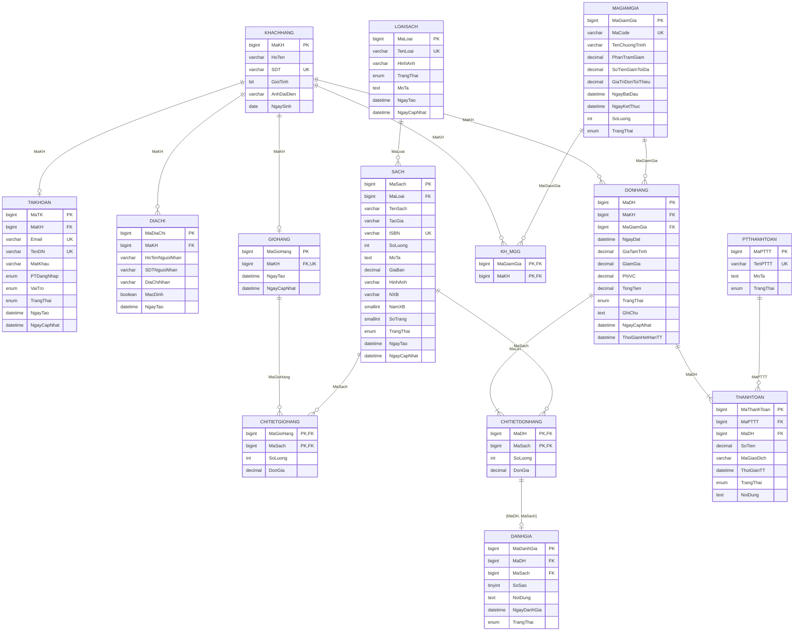
```mermaid
erDiagram
    KHACHHANG ||--o| TAIKHOAN : "MaKH"
    KHACHHANG ||--o{ DIACHI : "MaKH"
    KHACHHANG ||--o| GIOHANG : "MaKH"
    KHACHHANG ||--o{ DONHANG : "MaKH"
    KHACHHANG ||--o{ KH_MGG : "MaKH"
    MAGIAMGIA ||--o{ KH_MGG : "MaGiamGia"
    MAGIAMGIA ||--o{ DONHANG : "MaGiamGia"
    GIOHANG ||--o{ CHITIETGIOHANG : "MaGioHang"
    SACH ||--o{ CHITIETGIOHANG : "MaSach"
    LOAISACH ||--o{ SACH : "MaLoai"
    DONHANG ||--|{ CHITIETDONHANG : "MaDH"
    SACH ||--o{ CHITIETDONHANG : "MaSach"
    CHITIETDONHANG ||--o| DANHGIA : "(MaDH, MaSach)"
    DONHANG ||--|{ THANHTOAN : "MaDH"
    PTTHANHTOAN ||--o{ THANHTOAN : "MaPTTT"

    KHACHHANG {
        bigint MaKH PK
        varchar HoTen
        varchar SDT UK
        bit GioiTinh
        varchar AnhDaiDien
        date NgaySinh
    }
    TAIKHOAN {
        bigint MaTK PK
        bigint MaKH FK
        varchar Email UK
        varchar TenDN UK
        varchar MatKhau
        enum PTDangNhap
        enum VaiTro
        enum TrangThai
        datetime NgayTao
        datetime NgayCapNhat
    }
    DIACHI {
        bigint MaDiaChi PK
        bigint MaKH FK
        varchar HoTenNguoiNhan
        varchar SDTNguoiNhan
        varchar DiaChiNhan
        boolean MacDinh
        datetime NgayTao
    }
    LOAISACH {
        bigint MaLoai PK
        varchar TenLoai UK
        varchar HinhAnh
        enum TrangThai
        text MoTa
        datetime NgayTao
        datetime NgayCapNhat
    }
    SACH {
        bigint MaSach PK
        bigint MaLoai FK
        varchar TenSach
        varchar TacGia
        varchar ISBN UK
        int SoLuong
        text MoTa
        decimal GiaBan
        varchar HinhAnh
        varchar NXB
        smallint NamXB
        smallint SoTrang
        enum TrangThai
        datetime NgayTao
        datetime NgayCapNhat
    }
    GIOHANG {
        bigint MaGioHang PK
        bigint MaKH FK,UK
        datetime NgayTao
        datetime NgayCapNhat
    }
    CHITIETGIOHANG {
        bigint MaGioHang PK,FK
        bigint MaSach PK,FK
        int SoLuong
        decimal DonGia
    }
    MAGIAMGIA {
        bigint MaGiamGia PK
        varchar MaCode UK
        varchar TenChuongTrinh
        decimal PhanTramGiam
        decimal SoTienGiamToiDa
        decimal GiaTriDonToiThieu
        datetime NgayBatDau
        datetime NgayKetThuc
        int SoLuong
        enum TrangThai
    }
    KH_MGG {
        bigint MaGiamGia PK,FK
        bigint MaKH PK,FK
    }
    DONHANG {
        bigint MaDH PK
        bigint MaKH FK
        bigint MaGiamGia FK
        datetime NgayDat
        decimal GiaTamTinh
        decimal GiamGia
        decimal PhiVC
        decimal TongTien
        enum TrangThai
        text GhiChu
        datetime NgayCapNhat
        datetime ThoiGianHetHanTT
    }
    CHITIETDONHANG {
        bigint MaDH PK,FK
        bigint MaSach PK,FK
        int SoLuong
        decimal DonGia
    }
    PTTHANHTOAN {
        bigint MaPTTT PK
        varchar TenPTTT UK
        text MoTa
        enum TrangThai
    }
    THANHTOAN {
        bigint MaThanhToan PK
        bigint MaPTTT FK
        bigint MaDH FK
        decimal SoTien
        varchar MaGiaoDich
        datetime ThoiGianTT
        enum TrangThai
        text NoiDung
    }
    DANHGIA {
        bigint MaDanhGia PK
        bigint MaDH FK
        bigint MaSach FK
        tinyint SoSao
        text NoiDung
        datetime NgayDanhGia
        enum TrangThai
    }
```

---

## 🖼️ Giao Diện Thực Tế Của Hệ Thống (18 Màn Hình Đầy Đủ)

### 1. Phía Khách Hàng (Storefront — Mua sắm, Thanh toán trực tuyến & Hồ sơ cá nhân)

| Trang chủ & Danh mục sách | Đăng nhập & OAuth 2.0 (Google / Facebook) |
|---|---|
|  | 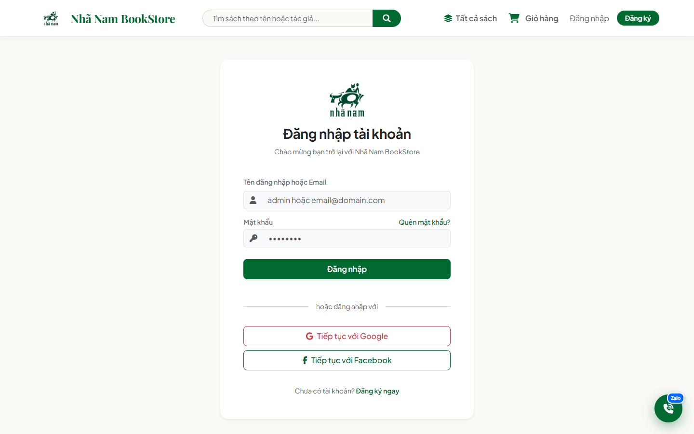 |

| Tìm kiếm & Bộ lọc sách theo thể loại / khoảng giá | Chi tiết sách, Thông số xuất bản & Đánh giá sao |
|---|---|
| 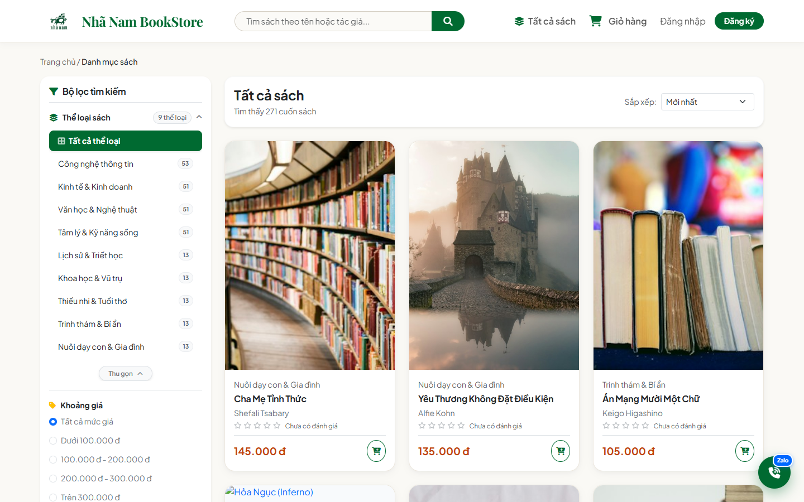 | 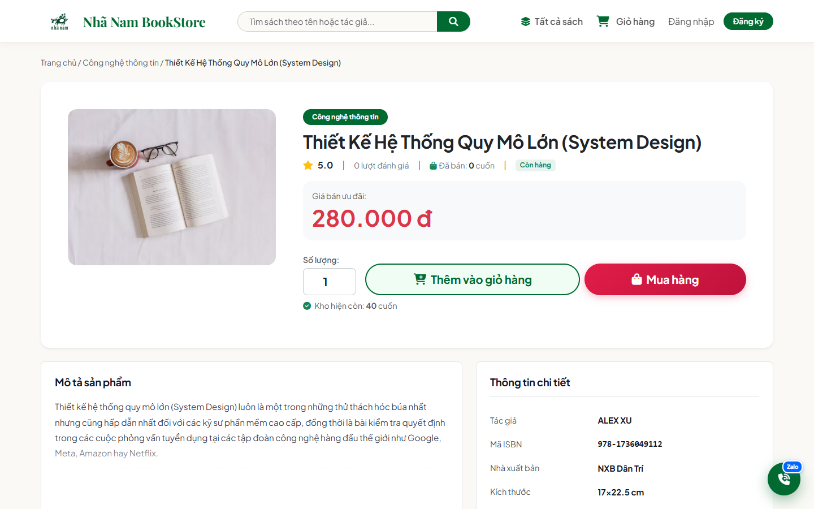 |

| Giỏ hàng thông minh & Kiểm tra tồn kho | Đặt hàng, Phí vận chuyển động & Ví Voucher (`KH_MGG`) |
|---|---|
| 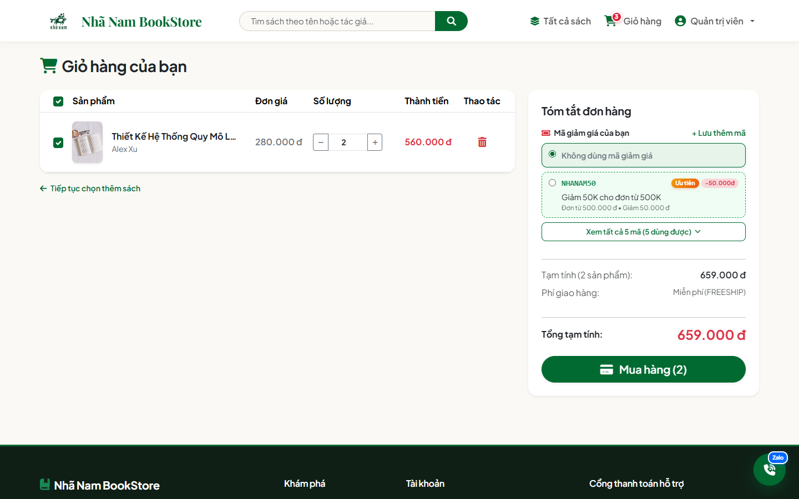 | 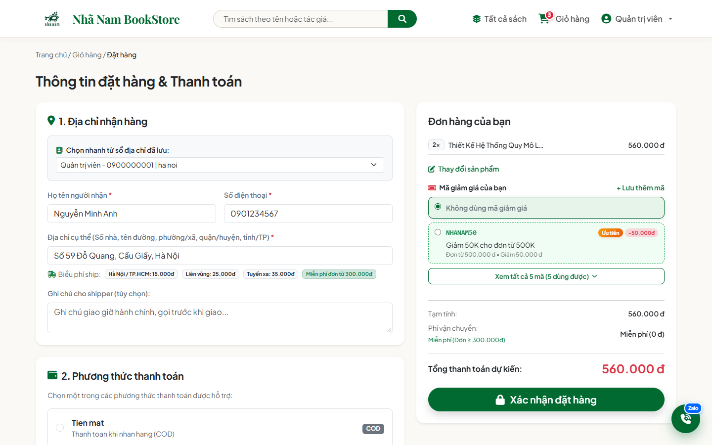 |

| Cổng thanh toán trực tuyến VietQR / MoMo | Lịch sử & Theo dõi trạng thái đơn hàng |
|---|---|
| 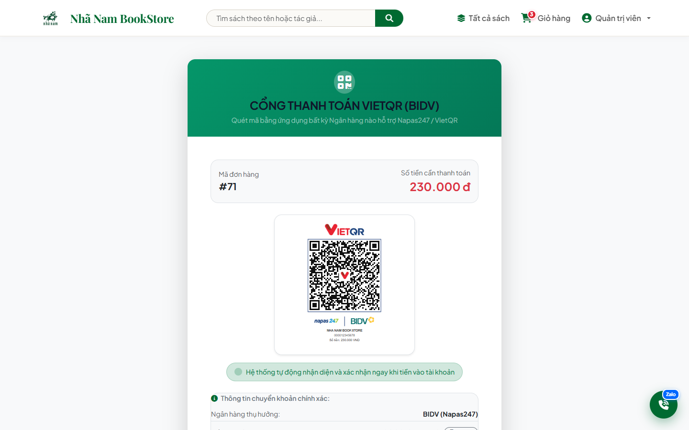 | 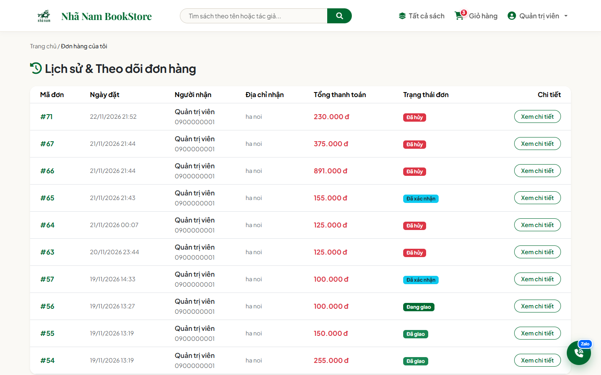 |

| Hóa đơn bán hàng điện tử & In hóa đơn | Hồ sơ cá nhân & Sổ địa chỉ giao hàng (`DIACHI`) |
|---|---|
| 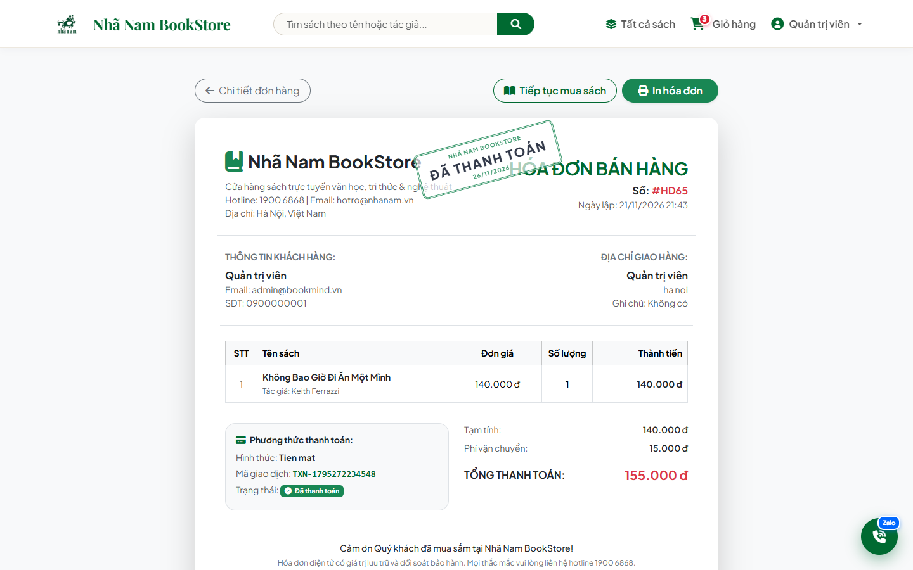 | 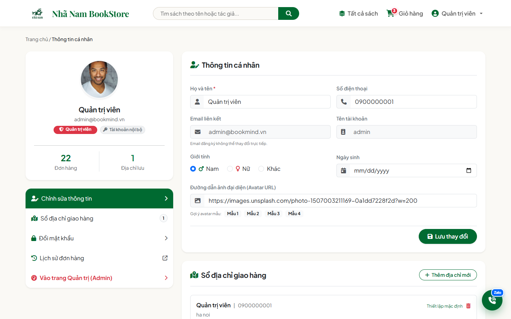 |

### 2. Phía Quản Trị Viên (Admin Panel — Toàn bộ 7 phân hệ quản trị)

| Bảng điều khiển Tổng quan (Dashboard) | Thống kê Doanh thu & Xuất báo cáo PDF |
|---|---|
| 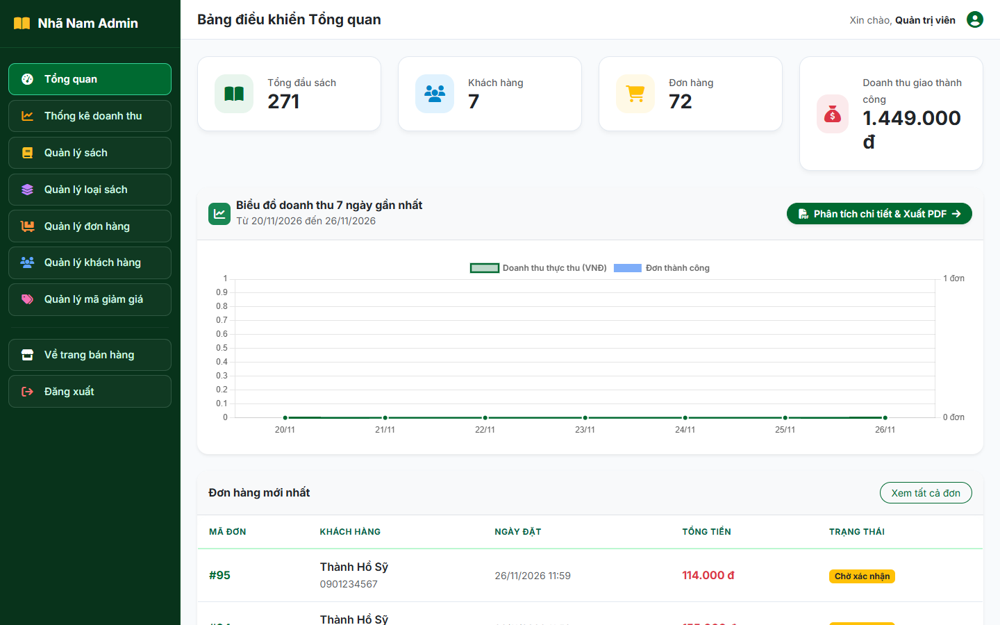 | 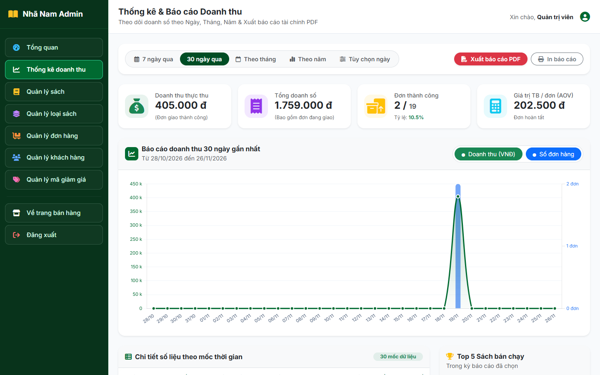 |

| Quản lý Kho sách & Tồn kho | Quản lý Loại sách & Thống kê số đầu sách |
|---|---|
| 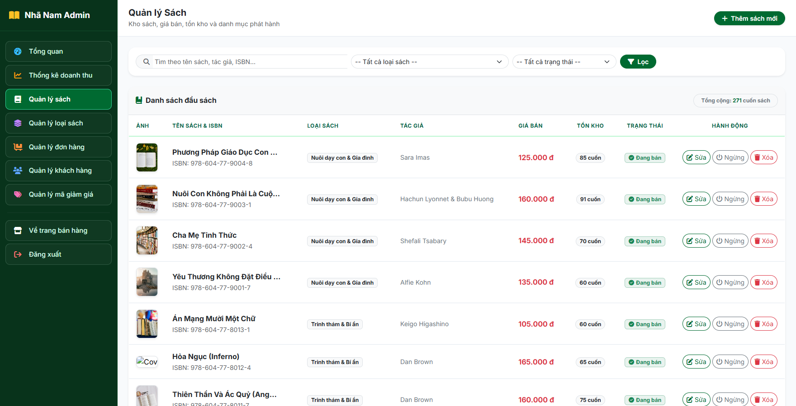 | 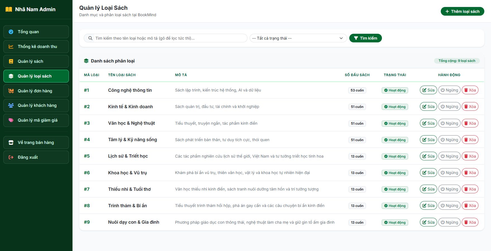 |

| Quản lý Đơn hàng & `@Scheduled` tự hủy đơn quá hạn | Quản lý Khách hàng, OAuth Badge & Khóa tài khoản |
|---|---|
| 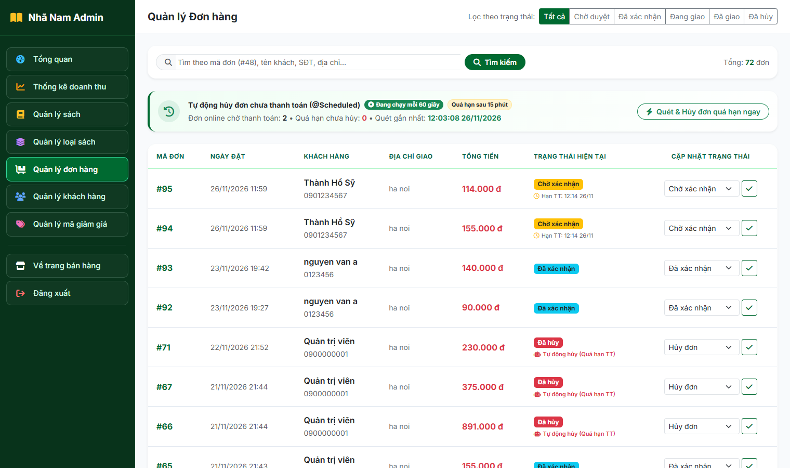 | 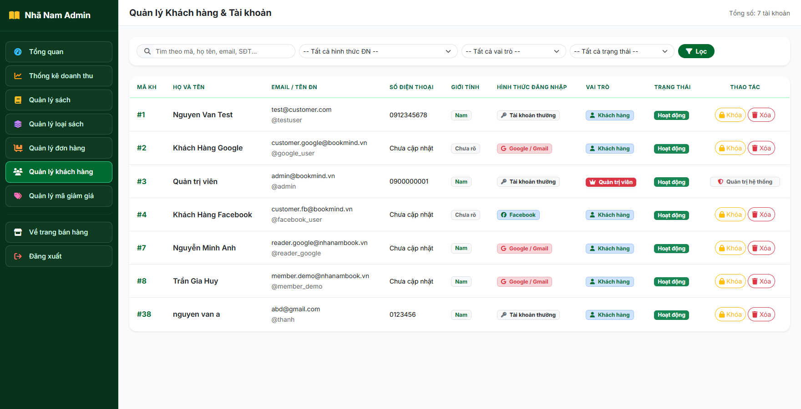 |

| Quản lý Mã giảm giá (`MAGIAMGIA`) | Ràng buộc chặn xóa Loại sách đang có đầu sách |
|---|---|
| 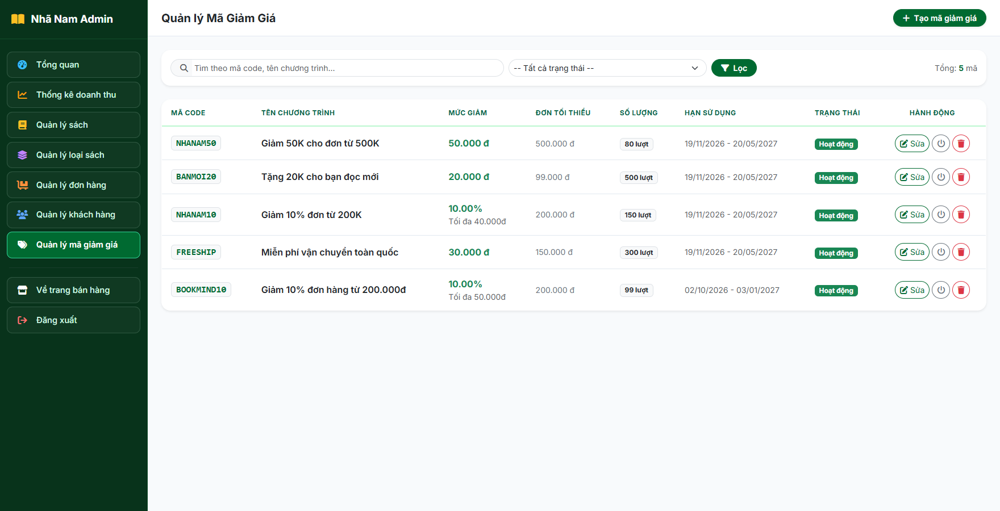 | 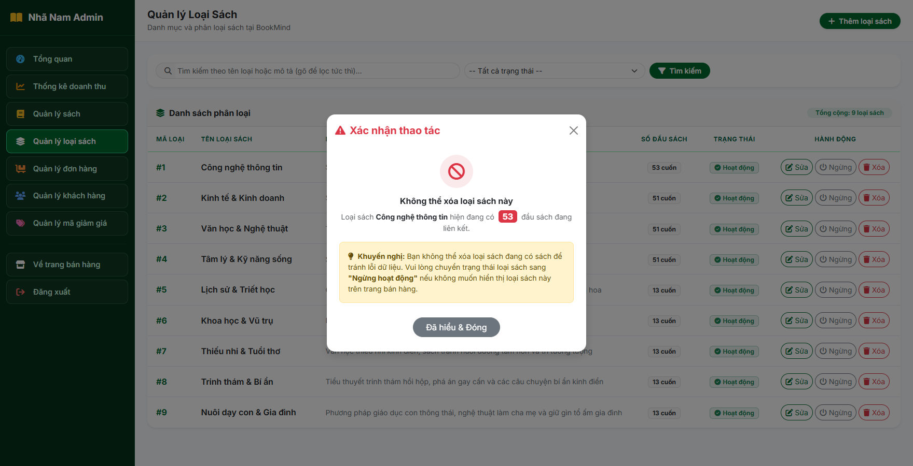 |

---

## 🔥 Điểm Nhấn Kỹ Thuật & Giải Pháp Nghiệp Vụ

### 1. Chống Race Condition (Âm Kho) Khi Đặt Hàng Đồng Thời
Thay vì chỉ đọc `sach.getSoLuong()` lên bộ nhớ Java rồi trừ (dễ dẫn tới âm kho hoặc lỗi `BIGINT UNSIGNED` khi 2 khách cùng đặt cuốn sách cuối cùng), dự án sử dụng **câu lệnh cập nhật nguyên tử có điều kiện (`@Modifying @Query`)** ngay trong Transaction đặt hàng (`SachRepository.deductStockAtomic` & `MaGiamGiaRepository.deductCouponQuantityAtomic`):

```java
@Modifying
@Query("UPDATE Sach s SET s.trangThai = CASE WHEN s.soLuong = :qty THEN 'HET_HANG' ELSE s.trangThai END, " +
       "s.soLuong = s.soLuong - :qty " +
       "WHERE s.maSach = :maSach AND s.soLuong >= :qty AND s.trangThai = 'DANG_BAN'")
int deductStockAtomic(@Param("maSach") Long maSach, @Param("qty") int qty);
```
- MySQL khóa dòng (row-level lock) trong suốt câu `UPDATE`. Nếu khách hàng thứ 2 chạm vào khi `soLuong < :qty`, số dòng cập nhật trả về bằng `0` → `DonHangService.createOrder()` lập tức ném ngoại lệ và `@Transactional` rollback toàn bộ đơn hàng.

### 2. Tính Phí Vận Chuyển Động & Ví Mã Giảm Giá Theo Tài Khoản (`KH_MGG`)
- **Phí vận chuyển (`DonHangService.calculateShippingFee`)**:
  - Nội thành Hà Nội & TP.HCM: `15.000đ`
  - Đà Nẵng, Hải Phòng, Cần Thơ & các tỉnh lân cận: `25.000đ`
  - Các tỉnh thành tuyến xa: `35.000đ`
  - **Miễn phí (`0đ`)**: Đơn hàng có tạm tính `>= 300.000đ` hoặc áp dụng mã giảm giá `FREESHIP`.
- **Ví Voucher (`SavedCouponService` + bảng `KH_MGG`)**:
  - Lưu trực tiếp mã giảm giá khách đã thu thập theo từng `MaKH` trong bảng `KH_MGG` (giữ nguyên khi đăng xuất/đăng nhập lại; tự động gộp mã lưu tạm từ `HttpSession` vào `KH_MGG` ngay khi khách đăng nhập).

### 3. Tự Động Hủy Đơn Quá Hạn Thanh Toán (`@Scheduled`)
- Mỗi đơn thanh toán trực tuyến (`VietQR` / `MoMo`) khi khởi tạo ở trạng thái `CHO_XAC_NHAN` được gắn mốc `ThoiGianHetHanTT = now + 15 phút`.
- Tác vụ nền `DonHangService.autoCancelExpiredUnpaidOrders()` chạy mỗi `60 giây`, truy vấn trực tiếp các đơn có `thoiGianHetHanTT <= :now` chưa thanh toán thành công để:
  1. Chuyển trạng thái đơn sang `DA_HUY`.
  2. Hoàn lại tồn kho cho từng đầu sách (`HET_HANG -> DANG_BAN`).
  3. Hoàn lại số lượng lượt dùng cho `MAGIAMGIA`.
  4. Chuyển bản ghi `THANHTOAN` sang `THAT_BAI`.

### 4. Tối Ưu Hiệu Năng Truy Vấn (Khử N+1 & In-Memory Filtering)
- Toàn bộ thống kê trên Admin Dashboard (Tổng doanh thu, Top khách hàng chi tiêu, Hiệu quả mã giảm giá) được đẩy xuống MySQL bằng JPQL `SUM / COUNT / GROUP BY` trong `DonHangRepository`.
- Sử dụng `JOIN FETCH` trên `DanhGiaRepository`, `root.fetch("taiKhoan", JoinType.LEFT)` trên `KhachHangService` và `@BatchSize(size = 50)` trên `Sach.danhSachDanhGia`.
- Cache số lượng sản phẩm giỏ hàng vào `HttpSession (SESSION_CART_COUNT)` trong `GlobalModelAdvice` để tránh truy vấn DB ở mọi request.

### 5. Cơ Chế Xác Thực & Bảo Mật
- Dự án sử dụng **`spring-security-crypto` (`BCryptPasswordEncoder`)** để băm mật khẩu kết hợp với **`HttpSession`** và **`AuthInterceptor` (`HandlerInterceptor`)** tự cài đặt để phân quyền `/admin/**` và `/shop/**` (không sử dụng full `SecurityFilterChain`).
- Chống brute-force mã OTP khôi phục mật khẩu (tối đa 5 lần thử sai, cooldown gửi lại 60 giây).
- Xác thực chữ ký `HMAC_SHA256` cho Webhook/Return URL MoMo và kiểm chứng trạng thái thanh toán thực tế với máy chủ PayOS (`payOSService.isPaymentPaid`).

---

## ⚙️ Bảng Biến Môi Trường & Cấu Hình Bảo Mật

File [`src/main/resources/application.properties`](./src/main/resources/application.properties) **không lưu bất kỳ khóa bí mật hay thông tin tài khoản ngân hàng cá nhân nào**. Khi chạy ở máy local, sao chép file mẫu [`src/main/resources/application-local.properties.example`](./src/main/resources/application-local.properties.example) thành `src/main/resources/application-local.properties` (file này đã nằm trong `.gitignore`) hoặc truyền qua biến môi trường:

| Biến môi trường / Property | Mô tả | Mặc định |
|---|---|---|
| `SPRING_DATASOURCE_URL` | JDBC URL kết nối MySQL `web_ban_sach` | `jdbc:mysql://localhost:3306/web_ban_sach?...` |
| `SPRING_DATASOURCE_USERNAME` | Tài khoản MySQL | `root` |
| `SPRING_DATASOURCE_PASSWORD` | Mật khẩu MySQL | *(Trống)* |
| `ORDER_UNPAID_TIMEOUT_MINUTES` | Thời gian chờ thanh toán online trước khi tự hủy | `15` (phút) |
| `PAYOS_CLIENT_ID` | Client ID cổng thanh toán PayOS | *(Trống)* |
| `PAYOS_API_KEY` | API Key cổng thanh toán PayOS | *(Trống)* |
| `PAYOS_CHECKSUM_KEY` | Checksum Key xác thực chữ ký PayOS | *(Trống)* |
| `MOMO_ACCESS_KEY` / `MOMO_SECRET_KEY` | Khóa kết nối cổng MoMo Sandbox/Gateway | *(Trống)* |
| `VIETQR_BANK_CODE` / `VIETQR_BANK_ACCOUNT` | Mã ngân hàng & STK fallback VietQR | `BIDV` / *(Trống)* |
| `GOOGLE_CLIENT_ID` / `GOOGLE_CLIENT_SECRET` | Thông tin ứng dụng Google OAuth 2.0 | *(Trống)* |
| `FACEBOOK_APP_ID` / `FACEBOOK_APP_SECRET` | Thông tin ứng dụng Facebook OAuth 2.0 | *(Trống)* |
| `SPRING_MAIL_USERNAME` / `SPRING_MAIL_PASSWORD` | Email & Gmail App Password gửi OTP | *(Trống)* |

---

## 🧪 Kiểm Thử (Unit Test Mockito & Integration Test)

Dự án bao gồm **2 tầng kiểm thử** trong `src/test/java/com/bookmind/`:

### 1. Chạy Unit Test độc lập (JUnit 5 + Mockito — **Không cần cài đặt MySQL**)
Kiểm thử trực tiếp logic nghiệp vụ của `DonHangService` (phí vận chuyển 15k/25k/35k/Freeship, `@Scheduled` tự hủy đơn & hoàn kho, chống âm kho đồng thời) và `LoaiSachService` (chặn xóa danh mục đang có sách, bật/tắt trạng thái):

```bash
mvn test -Dtest="*UnitTest"
# hoặc chỉ định rõ 2 lớp kiểm thử:
mvn test -Dtest=DonHangServiceUnitTest,LoaiSachServiceUnitTest
```

### 2. Chạy toàn bộ Integration Test (`@SpringBootTest` + `MockMvc` + MySQL `web_ban_sach`)
Khi đã khởi tạo MySQL `web_ban_sach` từ `CSDL_Web_Sach.sql`:

```bash
mvn test
```

---

## 🚀 Hướng Dẫn Cài Đặt & Chạy Ứng Dụng

1. **Khởi tạo Cơ sở dữ liệu**:
   - Mở MySQL Workbench (hoặc MySQL CLI), chạy script [`CSDL_Web_Sach.sql`](./CSDL_Web_Sach.sql) để tạo schema `web_ban_sach` gồm 14 bảng chuẩn ERD.
2. **Cấu hình môi trường local**:
   ```bash
   cp src/main/resources/application-local.properties.example src/main/resources/application-local.properties
   ```
   Điền `spring.datasource.password` (và các khóa API PayOS/SMTP nếu muốn thử nghiệm cổng thanh toán/gửi mail thực tế).
3. **Khởi chạy ứng dụng**:
   ```bash
   mvn spring-boot:run
   ```
4. **Truy cập**:
   - Trang khách hàng (Storefront): `http://localhost:8080`
   - Trang quản trị (Admin): `http://localhost:8080/admin` (Tài khoản mẫu tự khởi tạo khi DB trống: `admin` / `admin123`)

---

## 📝 Ghi Chú Minh Bạch & Bài Học Bảo Mật (Engineering Notes)

1. **Bài học xử lý lộ khóa bí mật (Secret Rotation & Git History Scrubbing)**:
   - Trong giai đoạn đầu phát triển, một số thông tin cấu hình thử nghiệm (PayOS keys và STK ngân hàng mặc định) từng bị commit trực tiếp vào `application.properties`.
   - **Cách khắc phục đã thực hiện**:
     - Thu hồi và tạo mới (**Rotate**) toàn bộ khóa API trên PayOS Dashboard.
     - Tách toàn bộ thông tin nhạy cảm sang `application-local.properties` (đưa vào `.gitignore`), cung cấp file mẫu `application-local.properties.example` và làm sạch lịch sử Git để không còn bất kỳ khóa bí mật nào trong lịch sử commit.
2. **Về việc sử dụng công cụ AI hỗ trợ (AI-Assisted Development)**:
   - Dự án có sử dụng công cụ AI hỗ trợ sinh nhanh khung giao diện HTML/Thymeleaf, dữ liệu sách mẫu và gợi ý refactoring.
   - Toàn bộ thiết kế lược đồ CSDL 14 bảng (ERD), luồng nghiệp vụ Đặt hàng & Thanh toán (`DonHangService`), Quản lý Loại sách (`LoaiSachService`), câu lệnh SQL trừ kho nguyên tử và bộ Unit Test (`DonHangServiceUnitTest`, `LoaiSachServiceUnitTest`) đều được tôi trực tiếp rà soát, viết kiểm thử và nắm vững từng dòng mã để bảo vệ/vấn đáp.
